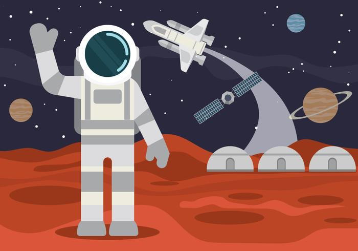
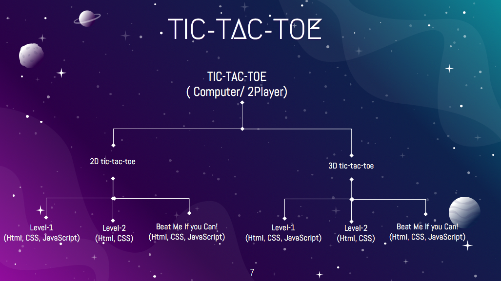

# PROJECT: ENTERTAIN THE CREW
  This project is a part of Engage'20 Mentorship Program. 
  
  check presentation: perseverance.pptx
  
  check Technical Documents: Technical Document Perseverence'20 
 
### About the project:
 Engaging the Crew by Using Minimax algorithm to build an unbeatable Tic Tac Toe game powered by AI.
    
    This project is made under the `Microsoft Mars colonization program` organized by Microsoft.
    It is a game website that provides tic tac toe games with additional features. This project is made under consideration of providing an entertainment platform to our crew 
    members during our Mars colonization program. We have designed different versions of the game using terminology level 1/level 2/ unbeatable etc. There are 6 different 
    versions of the same game we are providing on our website. The main highlight of this project is we have developed a new class of a game using the same set of rules of 
    tic-tac-toe but have a  3D version with some additional features and rules.

   In this project our goal is to take traditional tic-tac-toe to another level. For this purpose we are aimed to implement some currently used algorithms to shift the 2 player
   mode to one player by making one move to be played by computer. In our second phase of development we aimed to make the game more interesting and increase the difficulty level 
   of game by proving some additional features and in last phase, we train our computer to make move in our new design game with different level of smartness. 

<div align="center">


</div>


## 📋 Table of Contents
 ➡️   [Vision](#-vision)
 
 ➡️   [Tech Stack](#-tech-stack)

 ➡️   [Project Structure](#-project-structure)
 
 ➡️   [Setup Development Environment](#-steps-to-setup-development-environment)
 
 ➡️   [Learning Resources](#-learning-resources)
 
 ➡️   [User Manual](#-user-manual)
 
 ➡️   [Owner](#-owner)
 
 ## 👩‍ Vision
To make a fun and interacting game with exciting rules! A platform to learn while you enjoy!

## 🔆 Tech Stack
-  HTML
-  CSS
-  JavaScript
-  GitHub

## 🤷 Project Structure
<div align="center">


</div>

## 🚀 Steps to setup development environment
1.  Clone the repo
 ```bash
 git clone github.com/your_username/perseverance-20.git
 ```
 2. Open the folder in your favorite code editor and start adding modifications.
 3. Or just view it on our site "https://perseverance-20.github.io".

## 📝 Learning Resources

Read these articles to get a quick grab on github pages:
- [GitHub Pages](https://guides.github.com/features/pages/)

Resources to learn Git:
-  https://try.github.io/
 
 ## 💼 User Manual
 checkout our presentation ("perseverance.pptx")
 
 
 ## 👬 Owner
<a href="https://github.com/oshinsaini"><b>Oshin Saini</b></a><br /><a href="https://github.com/Sidsag"><b>Siddhi Mishra</b></a>


## 🧐 View Project
⭐ [Check out the website of Perseverance-20](https://perseverance-20.github.io/)
 
 

